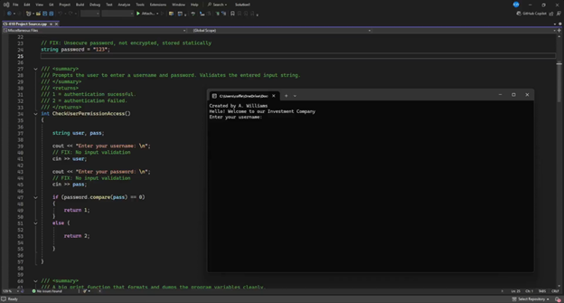
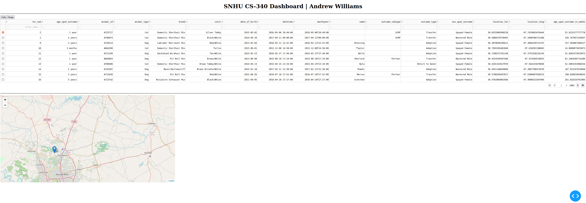
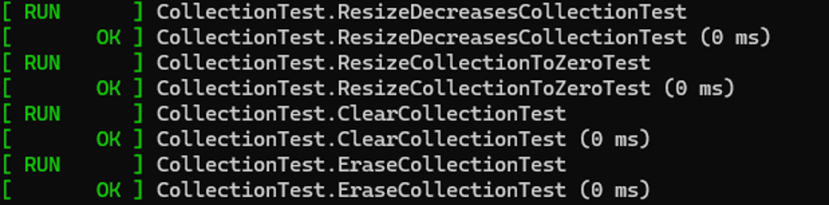
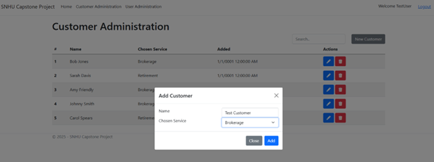
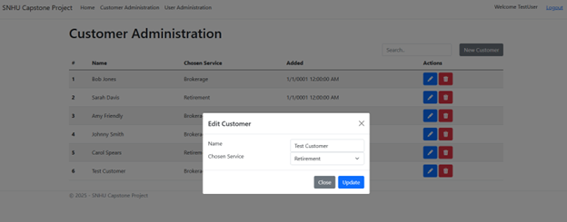
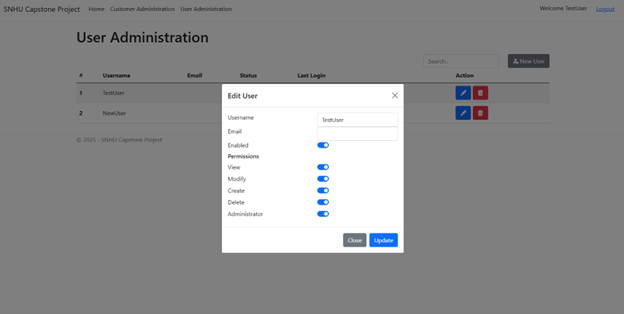
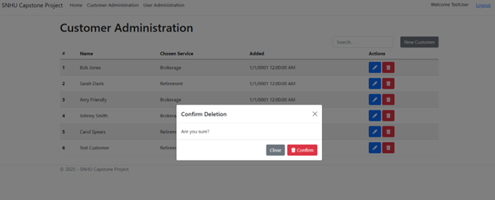

&nbsp;&nbsp;

## Introduction

This ePortfolio showcases the knowledge and skills I acquired during my Computer Science studies at Southern New Hampshire University (SNHU). It reflects my growth in the program and <a href='https://meritpages.com/coffeesips1'>honors</a> earned throughout.

## Professional Self Assessment

My journey through the computer science program at Southern New Hampshire University (SNHU) has been marked by a series of challenging projects and opportunities for growth that have collectively honed my skillset as a software engineer. Among these, my portfolio project, the development of an enhanced full-stack web application, stands out as a testament to my competence and employability in the field. 

	
    
<em>Figure 1 - CLI Project Overview - CS-410 Software Reverse Engineering</em>

The transformation of a CLI-based software into a comprehensive full-stack web application underscores my proficiency in both front-end and back-end development. Utilizing Microsoft's .NET and Entity Frameworks, I connected the application to an MSSQL database, enabling it to scale and utilize dynamic data. This project serves as a compelling demonstration of my extensive capabilities in software engineering and database management. By selecting an original artifact from a challenging course project, I showcased my ability to understand and reverse engineer compiled machine code, enhance basic applications, and integrate robust database solutions in a secure manor. My approach reflects my dedication to advancing my skillset and my readiness to tackle complex software design and implementation tasks in a professional setting.

	
    
<em>Figure 2 - Unit Testing Example - CS-340 Client / Server Development</em>

Collaboration is a cornerstone of effective software development, and throughout my academic and professional experiences, I have consistently demonstrated my ability to work effectively within team environments. By engaging with my peers and my instructors, I have fostered collaborative environments that support decision-making and innovation. My approach to teamwork is rooted in mutual respect, active listening, and a collaborative mindset, which enables me to contribute positively to any team dynamic. This is further reflected in the tutoring I offered to fellow classmates as we collaborated with the completion of various course materials

	
    
<em>Figure 3 - Unit Testing Example - CS-405 Secure Coding</em>

Security is a priority in my development process, and I consistently integrate measures to identify vulnerabilities and mitigate design flaws through secure coding practices and regular reviews. My portfolio project demonstrates my commitment to implementing security best practices, ensuring that applications are resilient against threats and attacks. By adopting a proactive approach to security, I have positioned myself as a responsible and forward-thinking software engineer, ready to contribute to the development of secure and reliable software solutions.

| **Hard Skills** | **Soft Skills** |
|:-----------:|:-----------:|
| C99/C++/C#/PHP/JS/Python | Problem Solving |
| Data Analysis | Time Management |
| Software Development | Critical Thinking |
| Web Development | Problem Solving |
| Security Mindset | Collaboration |

 

My professional goals are centered around continuous improvement and innovation in the field of computer science. I am committed to staying abreast of emerging technologies and industry trends, ensuring that my skills remain relevant and cutting-edge. My values are rooted in integrity, collaboration, and excellence, guiding my approach to every project and interaction. By fostering a culture of mutual respect and lifelong learning, I aim to contribute positively to the software engineering community and drive meaningful advancements in technology.

## Portfolio Enhancement Project - Introduction & Narrative

For my portfolio project, I had to make three improvements to demonstrate my skills as a software engineer. My improvements were to demonstrate advancements in software design, databases, algorithms and data structures. This is an overview of what I chose, why I chose it and the various improvements I made to the original project to reflect my skillset as a software engineer.

<blockquote style="font-size: 20px;">
    <em>“Web development is difficult, only then it is fun to do. You just have to set your standards. If it were to be easy, would anyone do it?”</em>
    
- Olawale Daniel

</blockquote>

I selected an original artifact for enhancement that stemmed from a project I undertook during the CS-410 course from my degree program. In CS-410, we were tasked with reverse engineering fully compiled machine code into an uncompiled state using C++. I decided to extend this project by transforming the initial CLI-based software into a comprehensive full-stack web application. Utilizing Microsoft's .NET and Entity Frameworks, I connected the application to an MSSQL database enabling the application to scale and utilize dynamic data.

	
    
<em>Figure 4 - Web App Overview - CS-499 Computer Science Capstone</em>

This project serves as a compelling demonstration of my extensive capabilities as a software engineer. By selecting an original artifact from a challenging course project, I showcased my ability to not only understand and reverse engineer compiled machine code but also to enhance a basic CLI application into a sophisticated full-stack web application. The use of Microsoft's .NET and Entity Frameworks, along with the integration of an MSSQL database, underscores my proficiency in both front-end and back-end development. This choice reflects my dedication to advancing my skills and my readiness to tackle complex software design and implementation tasks in a professional setting.

	

In reflection, I found that enhancing my project from a previous course was simple thanks to my confidence and experience with similar tasks. I keep old project files handy to reuse modular code, streamlining the implementation of similar functions. This approach allows me to quickly create secure applications using templates from prior works and enables my continual improvement process which involves enhancing related works based on learnings from working on code.

## Portfolio Enhancement Project - Code Review

	<iframe id="ytplayer" type="text/html" width="640" height="360" src="https://www.youtube.com/embed/AcxUeO4kWJA?autoplay=0" frameborder="0" allowfullscreen></iframe>
    
<em>Figure 5 - Project Code Review - CS-499 Computer Science Capstone</em>

Code reviews are essential components of software development, but it is important to avoid continuous optimization that may prevent the delivery of a final product.

<blockquote style="font-size: 20px;">
    <em>“Premature optimization is the root of all evil.”</em>
    
- Donald Knuth

</blockquote>

Code reviews ensure quality assurance for our project code and usually help software engineers to identify critical bugs and points of optimization. Despite the stigma about code reviews that details how they are unnecessary and bureaucratic, I choose to observe code reviews from a different angle. In a previous class I attended taught by Harvard professor David J. Malan, I learned about a process called rubber duck debugging. If you've never heard of it before, rubber duck debugging is a method of debugging code by articulating a problem in a spoken or written natural language. People often do this by talking to themselves or explaining a problem to a peer and through the process of talking through the problem, self-solving for a solution. A code review operates in much the same way and provides a systematic examination of the computer source code, to identify and improve inflections within the source.

## Portfolio Enhancement Project - Overview

Reviewing the revised project, it is completely different to the original CLI based app. The new web-based app offers the ability to make changes to customers that are persistant thanks to the design and implementation of a MSSQL back-end database...

	
    
<em>Figure 6 - Web App Overview - CS-499 Computer Science Capstone</em>

Manage user accounts that utilize encrypted passwords so that the passwords are personal and not shared (like before) and allow for various permissions to be assigned to different users through the implementation of algorithmic authentication and authorization mechanisms...

	
    
<em>Figure 7 - Web App Overview - CS-499 Computer Science Capstone</em>

UI / UX enhancements such as confirmation features and cancelation options to allow operators the oppotunity to cancel acidental tasks and prevent unintentional data loss...

	
    
<em>Figure 9 - Web App Overview - CS-499 Computer Science Capstone</em>

You can download and run both the original and redesigned project from <a href='https://github.com/CoffeeSips1/ePortfolio'>this</a> Github repo.

To run this project as is you will need a local MSSQL instance (express is free). Additionally note the default username and password stored in the config file: 
admin / admin

Changing the password in the configuration file is secure as the application will automatically encrypt the password and update the config file protecting the clear-text password from a potential breach.